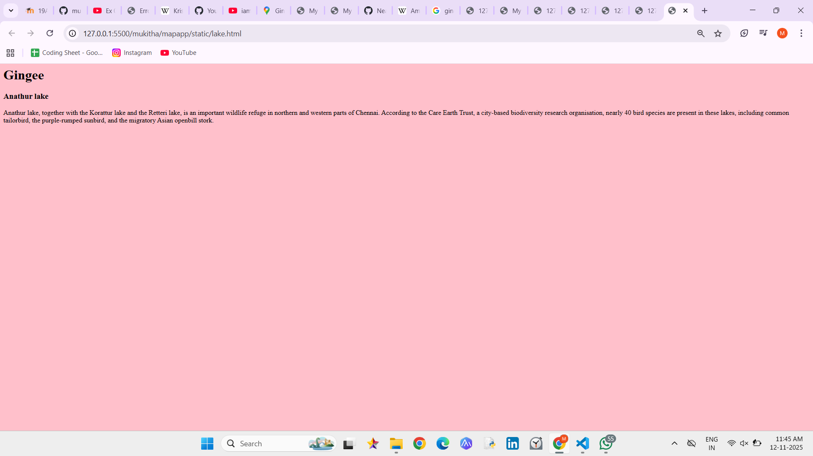
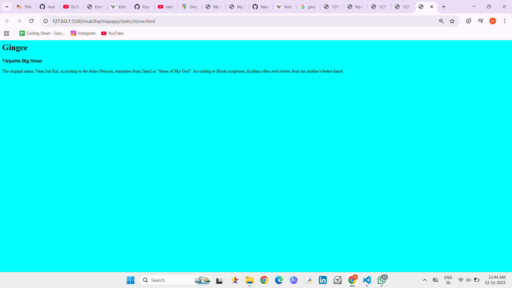
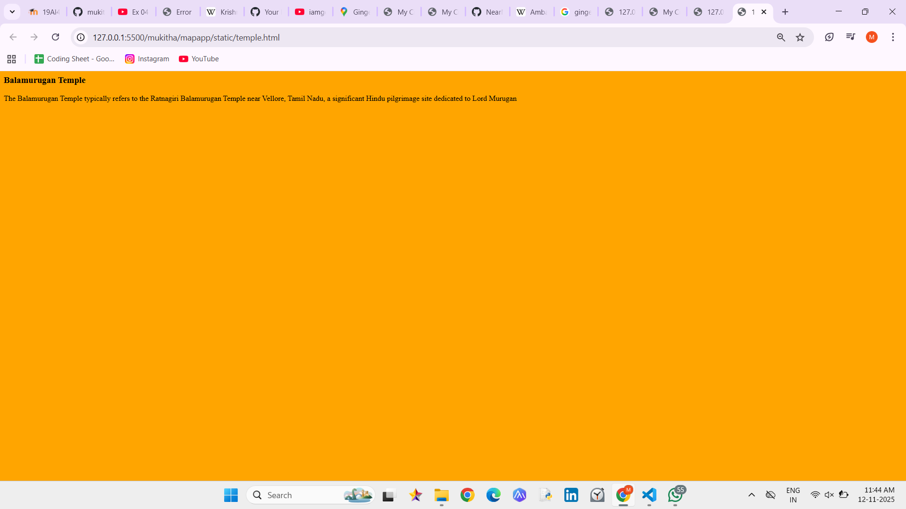
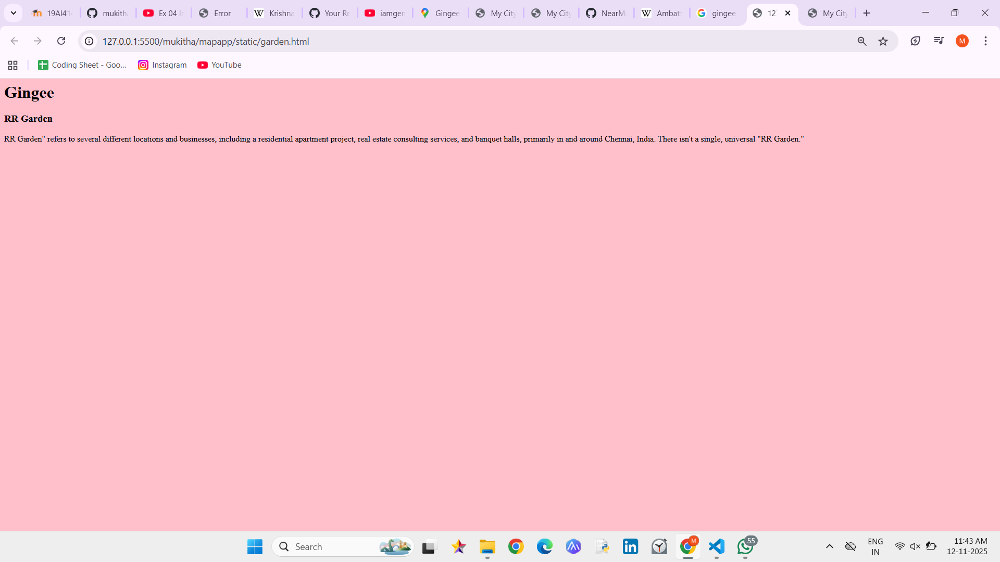

# Ex04 Places Around Me
## Date: 

## AIM
To develop a website to display details about the places around my house.

## DESIGN STEPS

### STEP 1
Create a Django admin interface.

### STEP 2
Download your city map from Google.

### STEP 3
Using ```<map>``` tag name the map.

### STEP 4
Create clickable regions in the image using ```<area>``` tag.

### STEP 5
Write HTML programs for all the regions identified.

### STEP 6
Execute the programs and publish them.

## CODE
```
map.html
<html>
    <head>
        <title>
            My City
        </title>
    </head>
    <body>
        <h1 align="center">
            <font color="Red"><b>Gingee</b></font>
        </h1>
        <h3 align="center">
            <font color=""blue><b>Mukitha V M (212223040119)</b></font>
        </h3>
        <center>
            
            <map name="MyCity">
            <area shape="rect" coords="700,250,900,900" href="home.html" title="My Home Town">
            <area shape="circle" coords="570,230,45" href="temple.html" title="Balamurugan temple">
            <area shape="circle" coords="640,200,30" href="lake.html" title="Anathur lake">
            <area shape="circle" coords="1120,360,25" href="garaden.html" title="RR garden">
            <area shape="rect" coords="950,120,1100,140" href="stone.html" title="Virpattu big stone">
            </map>
        </center>
    </body>
</html>

temple.html
<html>
    <body bgcolor="orange">
        <h1></h1>
        <h3> Balamurugan Temple  </h3>
<p>
 The Balamurugan Temple typically refers to the Ratnagiri Balamurugan Temple near Vellore, Tamil Nadu, a significant Hindu pilgrimage site dedicated to Lord Murugan
</p>
</body>
</html>

lake.html

<html>
    <body bgcolor="pink">
        <h1>Gingee</h1>
        <h3>Anathur lake</h3>
    <p>
        Anathur lake, together with the Korattur lake and the Retteri lake, is an important wildlife refuge in northern and western parts of Chennai. According to the Care Earth Trust, a city-based biodiversity research organisation, nearly 40 bird species are present in these lakes, including common tailorbird, the purple-rumped sunbird, and the migratory Asian openbill stork.
   </p>
    </body>
</html>

stone.html

<html>
    <body bgcolor="cyan">
        <h1>Gingee</h1>
        <h3> Virpattu Big Stone </h3>
<p>
    The original name, Vaan Irai Kal, according to the Atlas Obscura, translates from Tamil as "Stone of Sky God". According to Hindu scriptures, Krishna often stole butter from his mother's butter handi
</p>
   </body>
</html>

garden.html
<html>
    <body bgcolor="pink">
        <h1>Gingee</h1>
        <h3>RR Garden</h3>
    <p>RR Garden" refers to several different locations and businesses, including a residential apartment project, real estate consulting services, and banquet halls, primarily in and around Chennai, India. There isn't a single, universal "RR Garden." </p>
    </body>
</html>
```

## OUTPUT




.png>)


## RESULT
The program for implementing image maps using HTML is executed successfully.
